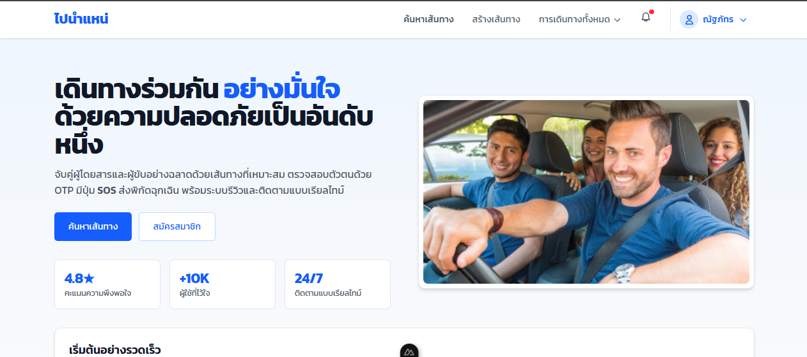
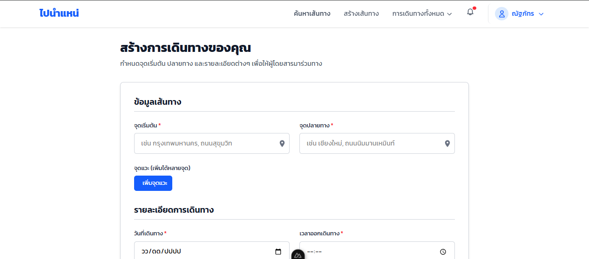
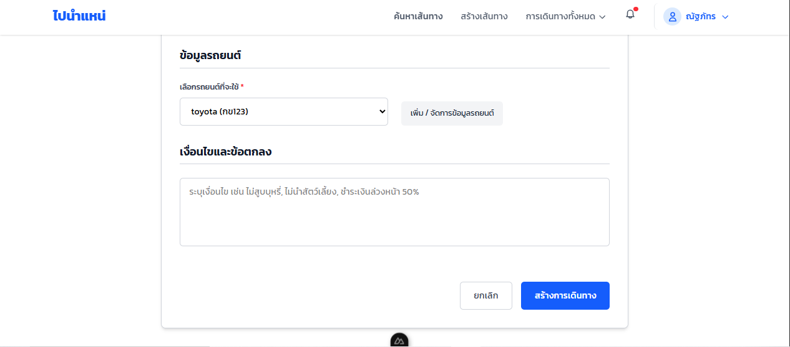
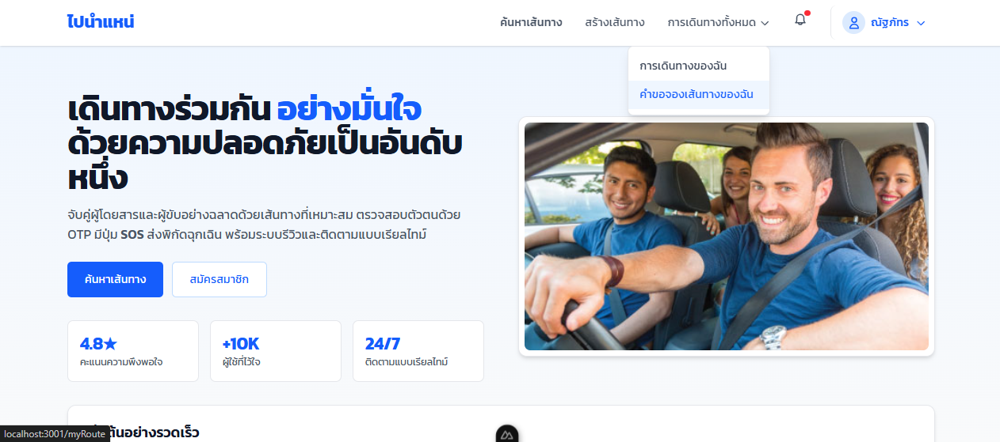
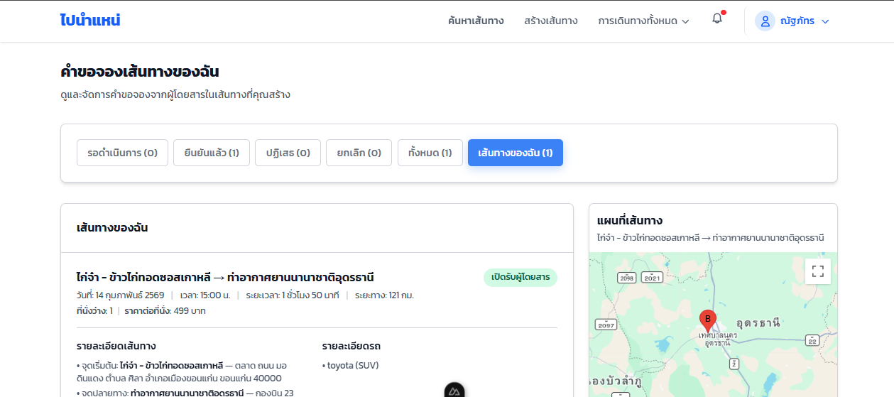
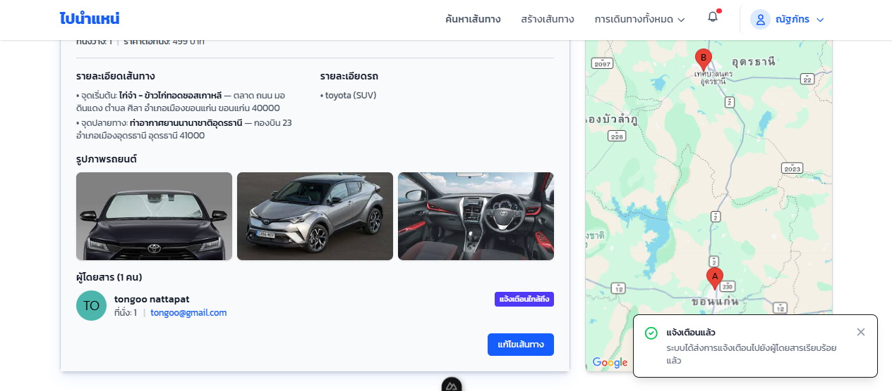
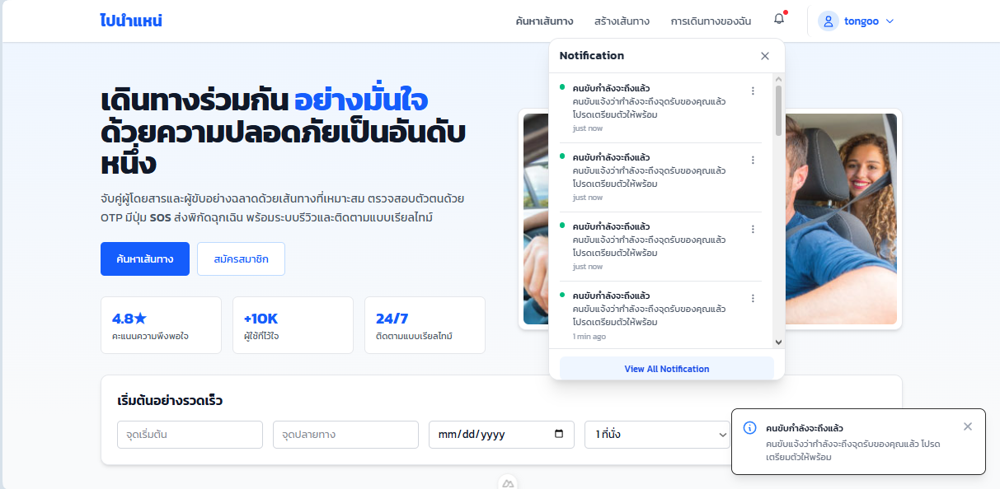

# คู่มือการใช้งานระบบ (User Manual)

---

### User - Driver

### สร้างเส้นทางการเดินทาง
กรอกรายละเอียดข้อมูลเส้นทาง เช่น  
- จุดเริ่มต้น  
- จุดปลายทาง  
- รายละเอียดการเดินทาง  
- ข้อมูลรถยนต์  

จากนั้นกดปุ่ม **สร้างการเดินทาง**

---

### ตรวจสอบคำขอจอง
เมื่อสร้างเส้นทางเรียบร้อย  
กดปุ่ม **“คำขอจองเส้นทางของฉัน”**

---

### แจ้งเตือนใกล้ถึง
Driver กดปุ่ม **“แจ้งเตือนใกล้ถึง”**  
ระบบจะส่งแจ้งเตือนไปยังผู้โดยสาร

---

## User - Passenger

### รับการแจ้งเตือน
Passenger จะได้รับข้อความแจ้งเตือนว่า  
**“คนขับกำลังจะถึงแล้ว”**

