# 📘 คู่มือการใช้งานระบบ (User Manual)
## สำหรับ Driver

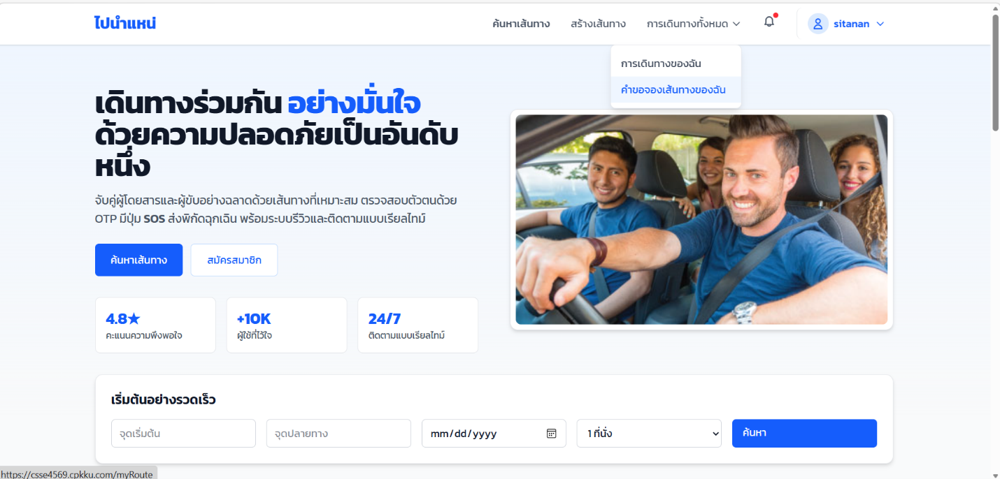

---

Driver ดูที่ **การเดินทางทั้งหมด** แล้วเลือก **คำขอจองเส้นทางของฉัน**
กดดูที่ **รอดำเนินการ** แล้วกด **ยืนยันคำขอ** passenger ที่ต้องการ

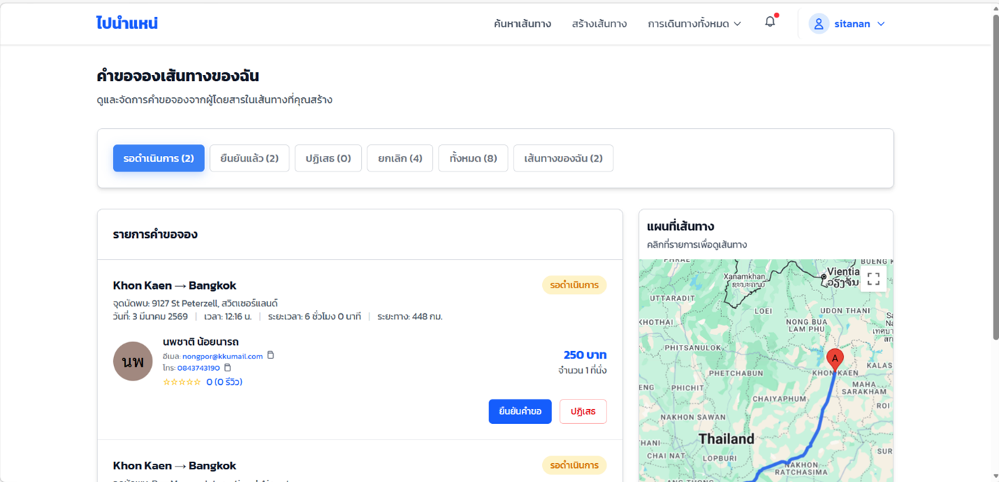

---

ระบบจะแสดงหน้าต่างยืนยันอีกครั้ง  
ให้กด **ยืนยันคำขอ** เพื่อยืนยันการรับผู้โดยสาร

---

## เริ่มการเดินทาง

ไปที่เมนู **เส้นทางของฉัน**
แล้วกดที่เส้นทางที่ **เปิดรับผู้โดยสารอยู่** ตรงที่ว่างของเส้นทาง

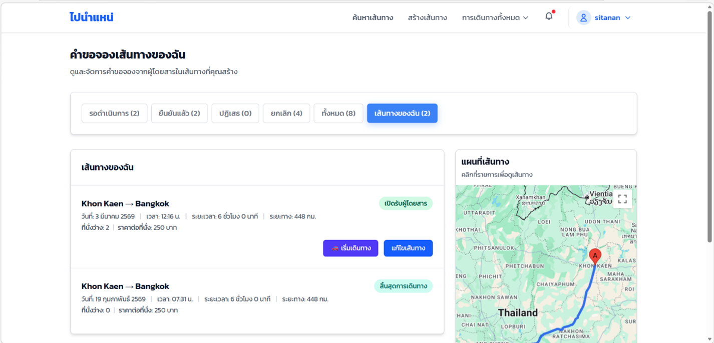

---

กดปุ่ม **เริ่มเดินทาง**

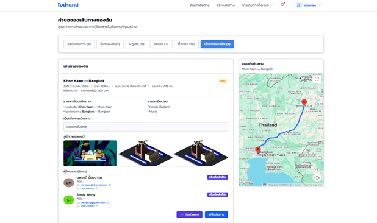

ระบบจะแสดงหน้าต่างยืนยันอีกครั้ง  
กด **เริ่มเดินทาง** อีกครั้งเพื่อยืนยัน

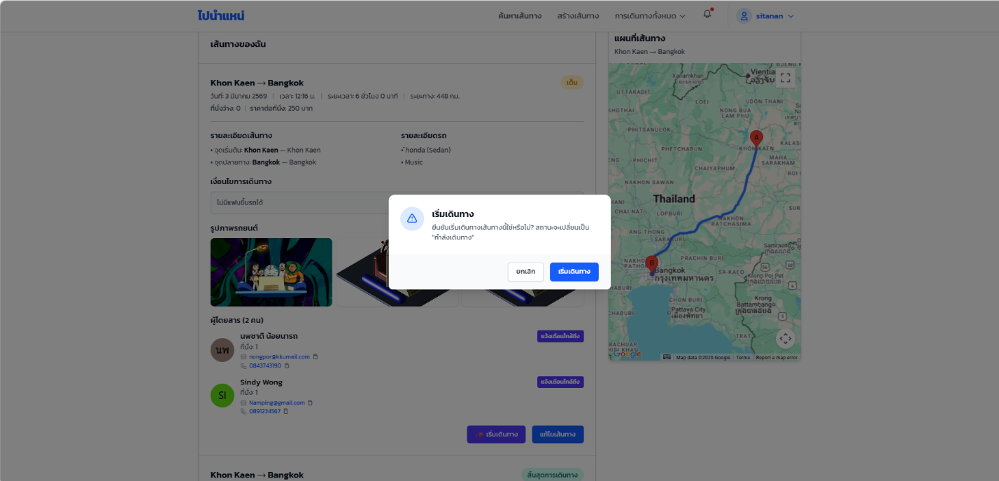

---

เมื่อเริ่มเดินทางแล้ว  
สถานะจะเปลี่ยนเป็น:

> **กำลังเดินทาง**

หาก Driver ถึงจุดหมายแล้ว ให้กดปุ่ม
**ถึงปลายทางแล้ว**

---

กด **ยืนยัน** เพื่อยืนยันการสิ้นสุดการเดินทาง

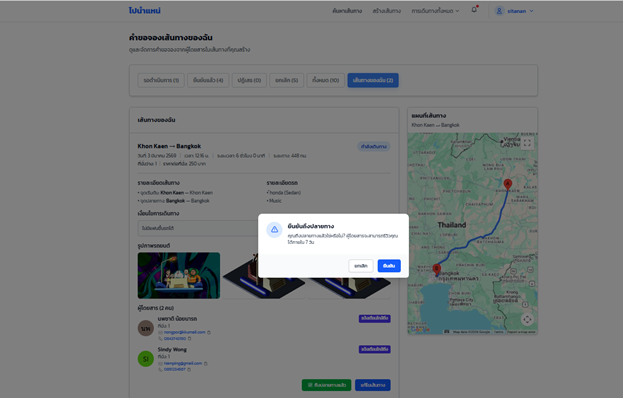

---

## สถานะสิ้นสุดการเดินทาง

สถานะการเดินทางเปลี่ยนเป็น **สิ้นสุดการเดินทาง**
แล้วระบบจะส่ง **Pop-up แจ้งเตือน** ไปยัง Passenger เพื่อให้ทำการรีวิว

---

---

## สำหรับ Passenger

คู่มือนี้อธิบายขั้นตอนการดูรีวิวคนขับ และการให้คะแนนหลังจบการเดินทาง สำหรับผู้โดยสาร (Passenger)

---

## การดูรีวิวของ Driver ก่อนจอง

ผู้โดยสารสามารถตรวจสอบรีวิวของคนขับก่อนตัดสินใจจองที่นั่งได้

### ขั้นตอน:

1. กดค้นหาเส้นทาง
2. คลิกที่ปุ่มไอคอนรูปดาว **เรตติ้ง**
3. ระบบจะแสดงรีวิวทั้งหมดของ Driver

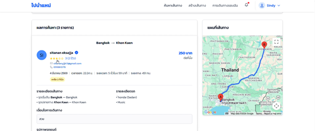
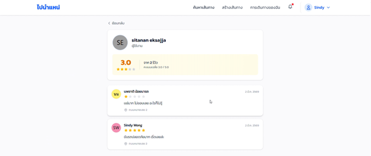

เมื่ออ่านรีวิวและพอใจแล้ว สามารถกดปุ่ม **จองที่นั่ง** เพื่อดำเนินการจองได้ทันที

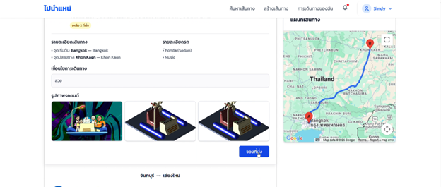

---

## การเดินทางเสร็จสิ้น

เมื่อการเดินทางเสร็จสิ้น ระบบจะแสดงการแจ้งเตือน

> “ถึงปลายทางแล้ว คุณสามารถรีวิวคนขับภายใน 7 วัน”

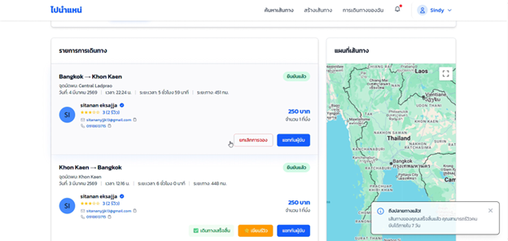

---

## Popup ให้คะแนนการเดินทาง

หลังจากรีเฟรชหน้าจอ ระบบจะแสดง Popup สำหรับให้คะแนนการเดินทาง

ผู้โดยสารสามารถเลือกได้:

- **รีวิวตอนนี้เลย**
- **ข้ามไปก่อน**

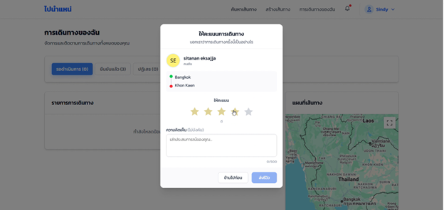

---

## การรีวิวภายหลัง (ภายใน 7 วัน)

หากผู้โดยสารเลือกข้าม สามารถกลับมารีวิวภายหลังได้ภายใน 7 วัน

### ขั้นตอน:

1. ไปที่เมนู **การเดินทางของฉัน**
2. เลือกรายการเดินทางที่ต้องการรีวิว
3. คลิกปุ่ม **เขียนรีวิว**

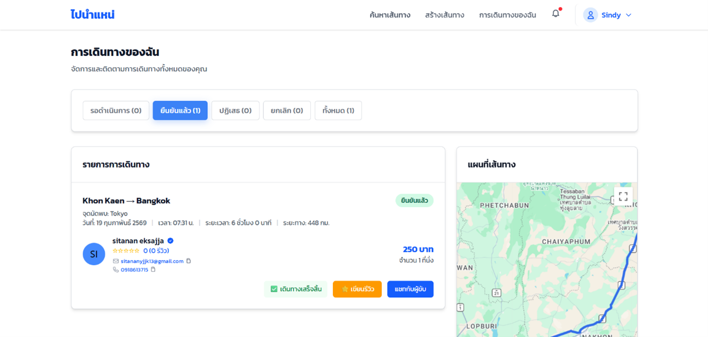
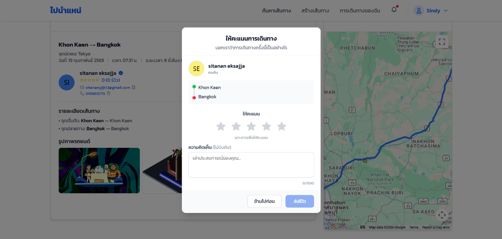

---

# เงื่อนไขการรีวิว

- สามารถรีวิวได้ภายใน **7 วัน** หลังจากสิ้นสุดการเดินทาง
- รีวิวได้เพียง **1 ครั้งต่อการเดินทาง**
- หลังส่งรีวิวแล้ว ไม่สามารถแก้ไขได้

---
