# คู่มือการใช้งานระบบ (User Manual)

## Product Backlog Item 15: Review System

เอกสารนี้อธิบายขั้นตอนการใช้งานระบบสำหรับ **Driver** และ **Passenger** ในการจัดการการเดินทาง การให้คะแนนรีวิว และการตรวจสอบรีวิว

---

# สำหรับ Driver

## 1. การยืนยันคำขอจองเส้นทาง

Driver สามารถตรวจสอบคำขอจองจากผู้โดยสารได้ผ่านเมนู **การเดินทางทั้งหมด**

### ขั้นตอนการยืนยันคำขอ

1. ไปที่เมนู **การเดินทางทั้งหมด**
2. เลือก **คำขอจองเส้นทางของฉัน**
3. ไปที่แท็บ **รอดำเนินการ**
4. เลือก Passenger ที่ต้องการรับ
5. กดปุ่ม **ยืนยันคำขอ**

ระบบจะแสดงหน้าต่างยืนยันอีกครั้ง

Driver กด **ยืนยันคำขอ** เพื่อยืนยันการรับผู้โดยสาร

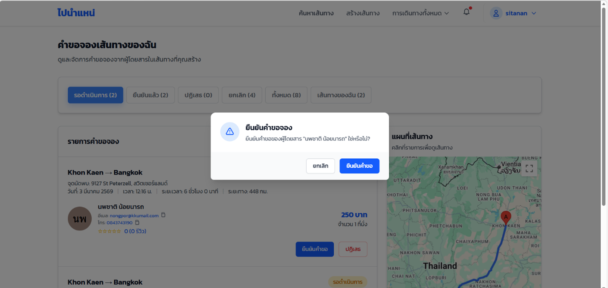

---

# การเริ่มการเดินทาง

เมื่อถึงเวลาการเดินทาง Driver สามารถเริ่มทริปได้จากเมนู **เส้นทางของฉัน**

### ขั้นตอนการเริ่มเดินทาง

1. ไปที่เมนู **เส้นทางของฉัน**
2. เลือกเส้นทางที่มีสถานะ **เปิดรับผู้โดยสารอยู่**
3. กดปุ่ม **เริ่มเดินทาง**

ระบบจะแสดงหน้าต่างยืนยันอีกครั้ง

Driver กด **เริ่มเดินทาง** เพื่อยืนยัน

---

## สถานะระหว่างการเดินทาง

เมื่อเริ่มเดินทางแล้ว ระบบจะเปลี่ยนสถานะเป็น

> **กำลังเดินทาง**

เมื่อ Driver ถึงจุดหมายปลายทาง ให้กดปุ่ม

**ถึงปลายทางแล้ว**

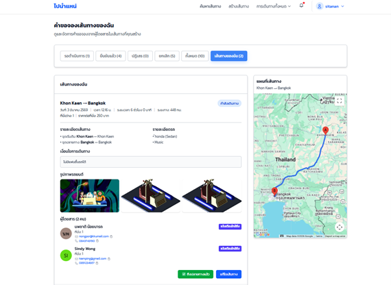

---

## การสิ้นสุดการเดินทาง

หลังจากกด **ถึงปลายทางแล้ว**

ระบบจะแสดงหน้าต่างยืนยันอีกครั้ง

Driver กด **ยืนยัน** เพื่อสิ้นสุดการเดินทาง

หลังจากนั้นสถานะจะเปลี่ยนเป็น

> **สิ้นสุดการเดินทาง**

และระบบจะส่ง **Pop-up แจ้งเตือนไปยัง Passenger เพื่อให้ทำการรีวิว**

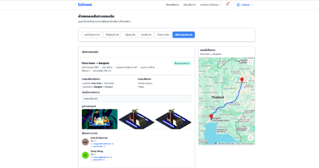

---

# สำหรับ Passenger

คู่มือนี้อธิบายวิธี **ตรวจสอบรีวิวของคนขับ และการให้คะแนนหลังการเดินทาง**

---

# การดูรีวิวของ Driver ก่อนจอง

Passenger สามารถตรวจสอบรีวิวของ Driver ก่อนตัดสินใจจองที่นั่งได้

### ขั้นตอน

1. ค้นหาเส้นทางที่ต้องการเดินทาง
2. คลิกที่ไอคอน **รูปดาว (Rating)**
3. ระบบจะแสดงรีวิวทั้งหมดของ Driver

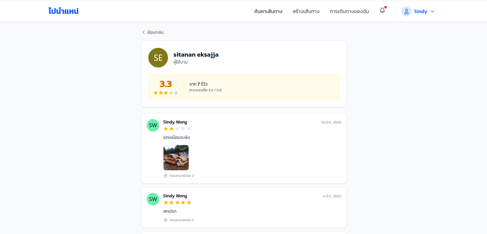

เมื่ออ่านรีวิวเรียบร้อยแล้ว สามารถกดปุ่ม **จองที่นั่ง** เพื่อดำเนินการจองได้ทันที

---

# การรีวิวหลังจบการเดินทาง

เมื่อการเดินทางเสร็จสิ้น ระบบจะแสดงการแจ้งเตือน

> “ถึงปลายทางแล้ว คุณสามารถรีวิวคนขับภายใน 7 วัน”

---

## Popup ให้คะแนนการเดินทาง

หลังจากรีเฟรชหน้าจอ ระบบจะแสดง **Popup สำหรับให้คะแนนการเดินทาง**

Passenger สามารถเลือกได้ 2 ตัวเลือก

- **รีวิวตอนนี้เลย**
- **ข้ามไปก่อน**

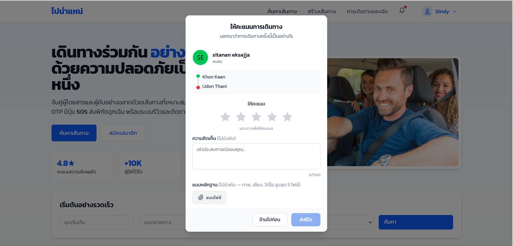

---

# การรีวิวภายหลัง (ภายใน 7 วัน)

หากผู้โดยสารเลือก **ข้ามไปก่อน** สามารถกลับมารีวิวได้ภายใน 7 วัน

### ขั้นตอน

1. ไปที่เมนู **การเดินทางของฉัน**
2. เลือกรายการเดินทางที่ต้องการรีวิว
3. คลิกปุ่ม **เขียนรีวิว**

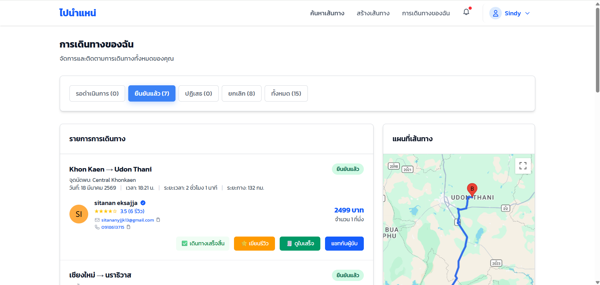

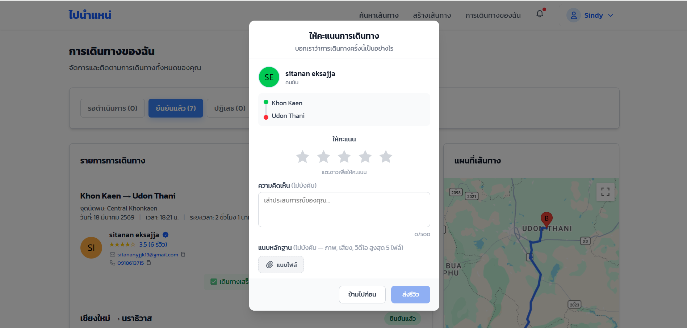

---

# เงื่อนไขการรีวิว

- สามารถรีวิวได้ภายใน **7 วัน** หลังจากการเดินทางสิ้นสุด
- สามารถรีวิวได้ **1 ครั้งต่อการเดินทาง**
- หลังจากส่งรีวิวแล้ว **ไม่สามารถแก้ไขได้**

---

# Product Backlog Item: Bonus Payment Receipt

ระบบรองรับการ **ชำระเงินและออกใบเสร็จหลังจบการเดินทาง**

---

# สำหรับ Driver

Driver สามารถจัดการสถานะการชำระเงินได้ผ่านเมนู **เส้นทางของฉัน**

### ขั้นตอน

1. ไปที่เมนู **คำขอจองเส้นทาง**
2. เลือก **เส้นทางของฉัน**
3. เมื่อถึงปลายทาง ให้กด **ถึงปลายทางแล้ว**

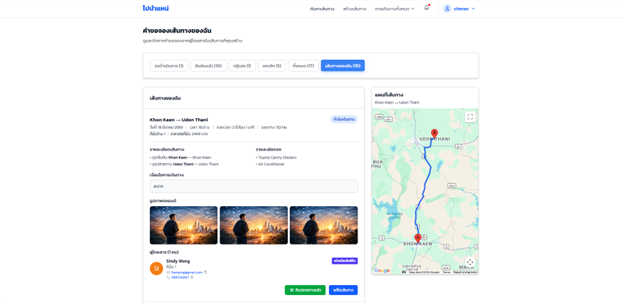

ระบบจะแสดง Pop-up **ยืนยันถึงปลายทางแล้ว**

Driver กด **ยืนยัน** เพื่อสิ้นสุดการเดินทาง

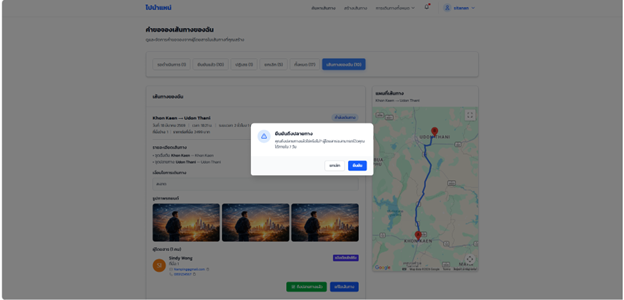

---

หลังจากยืนยันแล้ว ระบบจะแสดง **Pop-up แจ้งเตือนว่าสำเร็จ**

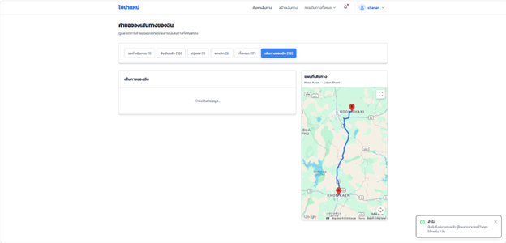

สถานะของการเดินทางจะเปลี่ยนเป็น

> **สิ้นสุดการเดินทาง**

และระบบจะแสดงสถานะ

> **รอผู้โดยสารชำระเงิน**

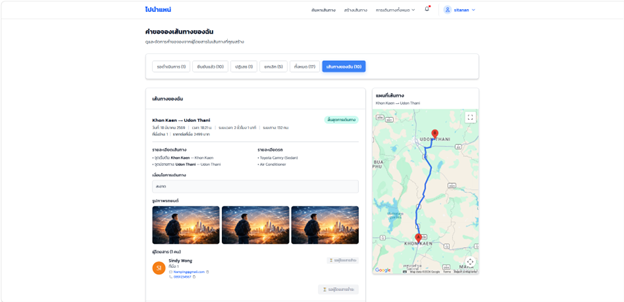

---

เมื่อผู้โดยสารชำระเงินเรียบร้อยแล้ว

Driver ให้ **รีเฟรชหน้าจอ**

สถานะจะเปลี่ยนเป็น

> **ยืนยันรับเงิน**

Driver กด **ยืนยันรับเงิน**

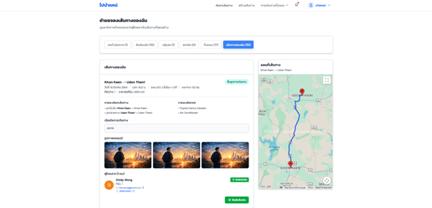

---

หลังจากยืนยันรับเงินแล้ว

ระบบจะแจ้งเตือนว่า **ยืนยันรับเงินเรียบร้อย**

Driver และ Passenger สามารถเปิดดู **ใบเสร็จรับเงิน** ได้ทันที

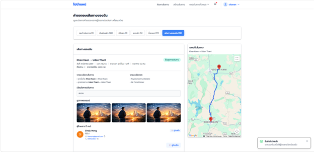

---

# สำหรับ Passenger

Passenger สามารถเลือกวิธีการชำระเงิน และตรวจสอบใบเสร็จได้ผ่านระบบ

---

# การเลือกวิธีการชำระเงิน

หลังจากจองเส้นทาง ระบบจะแสดงหน้าชำระเงิน พร้อมรายละเอียดการเดินทาง เช่น

- เส้นทาง
- คนขับ
- จำนวนเงินที่ต้องชำระ

Passenger สามารถเลือกวิธีการชำระเงินได้ 2 วิธี

- **เงินสด**
- **โอนเงิน**

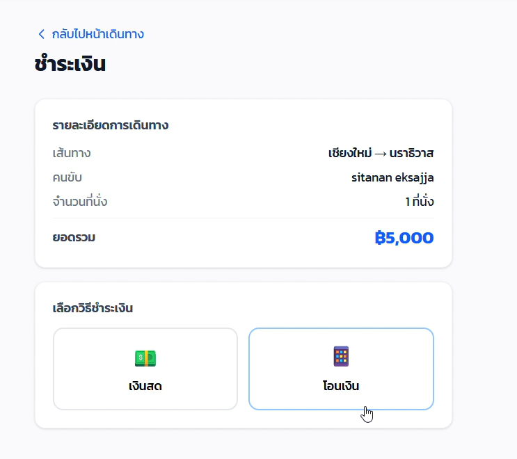

---

# รอการยืนยันจาก Driver

หลังจากเลือกวิธีชำระเงิน ระบบจะแสดงสถานะ

> **รอคนขับยืนยันรับเงิน**

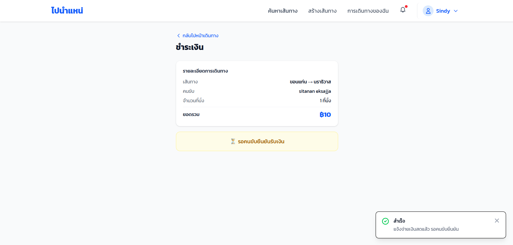

Passenger ต้องชำระเงินให้ Driver หลังจากการเดินทางเสร็จสิ้น

เมื่อ Driver ได้รับเงินแล้ว จะกด **ยืนยันรับเงิน** ในระบบ

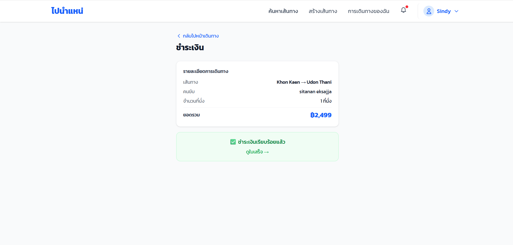

---

# การแสดงใบเสร็จรับเงิน

หลังจาก Driver ยืนยันรับเงินเรียบร้อยแล้ว

ระบบจะสร้าง **ใบเสร็จรับเงิน (Receipt)** สำหรับการเดินทางนั้น

Passenger สามารถเปิดดูใบเสร็จได้จากระบบ

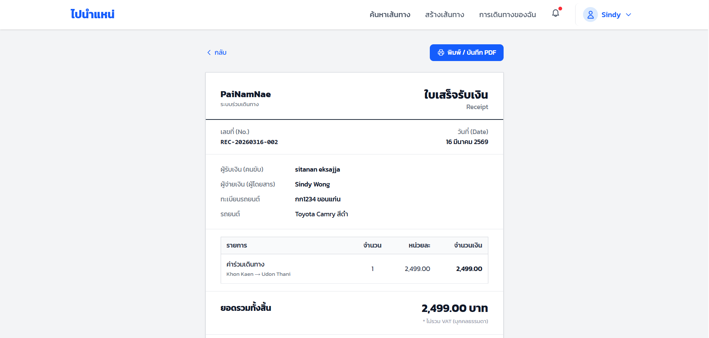

สามารถพิมพ์ใบเสร็จได้โดยกดปุ่ม **พิมพ์**

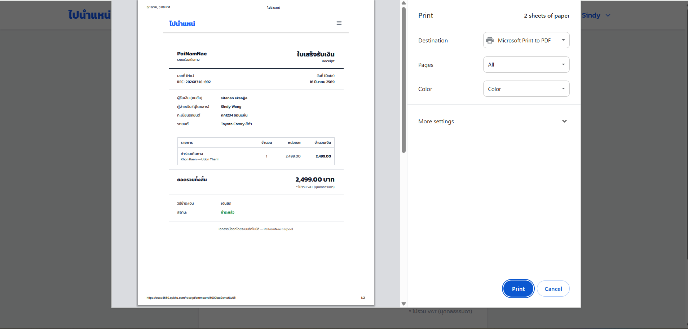

---

# รายละเอียดในใบเสร็จรับเงิน

ใบเสร็จจะแสดงข้อมูลสำคัญ เช่น

- **เลขที่ใบเสร็จ (Receipt Number)**
- **วันที่ชำระเงิน**
- **ชื่อผู้รับเงิน (Driver)**
- **ชื่อผู้จ่ายเงิน (Passenger)**
- **ทะเบียนรถยนต์**
- **รายละเอียดการเดินทาง**
- **จำนวนเงินที่ชำระ**
- **ยอดรวมทั้งหมด**

ข้อมูลเหล่านี้ใช้เป็น **หลักฐานยืนยันว่าการชำระเงินเสร็จสมบูรณ์**